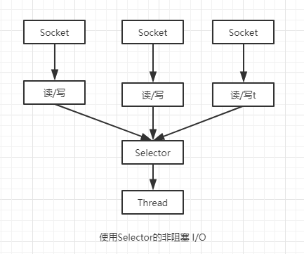
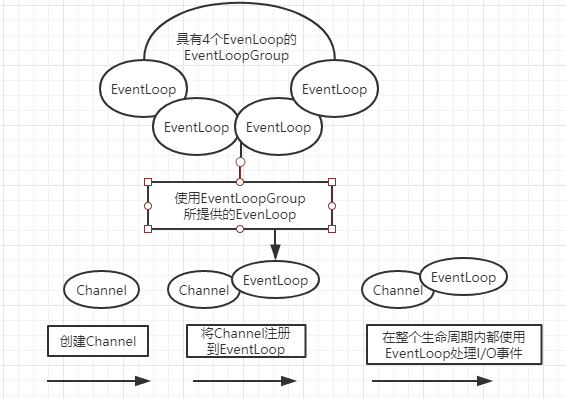
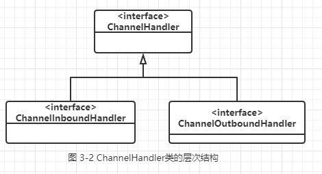
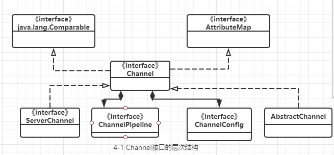
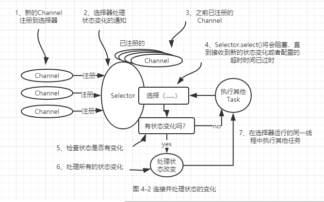

#Netty实战
##1、Netty-异步和事件驱动
    1、Java网络编程
       1、Java NIO
       2、选择器（Selector）
       下图展示了一个非阻塞设计。
       与阻塞I/O模型相比，这种模型提供了更好的资源管理
         1、使用较少的线程便可以处理许多连接，因此也减少内存管理和上下文切换所带来的的开销
         2、当没有I/O操作需要处理的时候，线程也可以被用于其他任务
   

    2、Netty简介
        1、Netty的核心组件：Channel、回调、Future、事件和ChannelHandler
           1、Channel：Java NIO 的一个基本构造
               它代表一个到实体的开放连接，如读操作和写操作。可以把Channel看作是传入或者传出数据的载体。
           2、回调：一个回调其实就是一个方法，一个指向已经被提供给另一个方法的方法的引用。
               public class ConnectHandle extends ChannelInboundHandlerAdapter{
                      @Override
                      public void channelActive(ChannelHandlerContext ctx){
                           // 当一个新的连接已经被建立时，channelActive（ChannelHandlerContext）将会被调用
                      }
               }   
           3、Future：提供了另一种在操作完成时通知应用程序的方式。这个对象可以看做是一个异步操作的结果的占位符；它将在未来的某个时刻完成，并提供其结果的访问。
              Netty 实现---ChannelFuture，用于执行异步操作的时候使用。
           4、事件和ChannelHandler
              Netty使用不同的事件来通知我们状态的改变或者是操作的状态
              
              
##2、第一个Netty Demo
    1、编写Echo服务器
       至少一个ChannelHandler---该组件实现了服务器对从客户端接收的数据的处理，即它的业务
       引导---这是配置服务器的启动代码。至少，它会将服务器绑定到它要监听连接的请求的端口上。
       1、ChannelHandler和业务逻辑
          EchoServerHandler.java
              @ChannelHandler.Sharable// 标示一个ChannelHandler可以被多个Channel安全的共享
              public static class EchoServerHandler extends ChannelInboundHandlerAdapter {
                  @Override
                  public void channelRead(ChannelHandlerContext ctx, Object msg) {
                      ByteBuffer in = (ByteBuffer) msg;
                      System.out.println("Server received: " + in.toString());//将消息记录到控制台
                      ctx.write(in); //将接收到的消息写给发送者，而不冲刷出站消息
                  }
                  @Override
                  public void channelReadComplete(ChannelHandlerContext ctx) {
                      ctx.writeAndFlush(Unpooled.EMPTY_BUFFER)
                              .addListener(ChannelFutureListener.CLOSE); //将未决消息冲刷到远程节点，并且关闭该Channel
                  }
                  @Override
                  public void exceptionCaught(ChannelHandlerContext ctx,
                                              Throwable cause) {
                      cause.printStackTrace();//打印异常栈跟踪
                      ctx.close();//关闭该Channel
                  }
              } 
       2、引导服务器
          绑定到服务器将在其上监听并接收传入连接请求的端口；
          配置Channel，以将有的入站消息通知给EchoServerHandler实例。
          EchoServer.java
             public class EchoServer {
             
                 private final int port;
             
                 public EchoServer(int port) {
                     this.port = port;
                 }
                 public void start() throws InterruptedException {
                     EventLoopGroup eventExecutors=new NioEventLoopGroup();
                     try{
                         ServerBootstrap b=new ServerBootstrap();
                         b.group(eventExecutors).channel(NioServerSocketChannel.class).localAddress(port).childHandler(new ChannelInitializer<Channel>() {
                             protected void initChannel(Channel channel) throws Exception {
                                 channel.pipeline().addLast(new EchoServerHandler());
                             }
                         });
                         ChannelFuture channelFuture=b.bind().sync();
                         System.out.println(EchoServer.class.getName()+"Started and listen on "+channelFuture.channel().localAddress());
                         channelFuture.channel().closeFuture().sync();
                     }finally {
                         eventExecutors.shutdownGracefully().sync();
                     }
                 }
                 public static void main(String[] args) throws InterruptedException {
                     new EchoServer(65535).start();
                 }
              }        
    2、编写EchoClient
       EchoClient：（1）连接到服务器；
                   （2）发送一个或者多个消息；
                   （3）对于每个消息，等待并接收从服务器发回的相同的信息；
                   （4）关闭连接
        1、通过ChannelHandler实现客户端逻辑
           public static class EchoClientHandler extends SimpleChannelInboundHandler<ByteBuffer> {
           
                   @Override
                   public void channelActive(ChannelHandlerContext ctx) {
                       ctx.writeAndFlush(Unpooled.copiedBuffer("Netty rocks!",//当被通知Channel是活跃的时候，发送一条消息
                               CharsetUtil.UTF_8));
                   }
           
                   @Override
                   public void channelRead0(ChannelHandlerContext ctx, ByteBuffer in) {
                       System.out.println(//记录已接收消息的转储
                               "Client received: " + in.toString());
                   }
           
                   @Override
                   public void exceptionCaught(ChannelHandlerContext ctx,//在发生异常时，记录错误并关闭Channel
                                               Throwable cause) {
                       cause.printStackTrace();
                       ctx.close();
                   }
           }
        2、引导客户端
            public class EchoClient {
            
                private final String host;
            
                private final int port;
            
                public EchoClient(String host, int port) {
                    this.host = host;
                    this.port = port;
                }
            
                public void start() throws InterruptedException {
                    EventLoopGroup  eventLoopGroup=new NioEventLoopGroup();
                    try{
                        Bootstrap b=new Bootstrap();
                        b.group(eventLoopGroup).channel(NioSocketChannel.class).remoteAddress(new InetSocketAddress(host,port)).
                                handler(new ChannelInitializer<SocketChannel>() {
                                    protected void initChannel(SocketChannel socketChannel) throws Exception {
                                        socketChannel.pipeline().addLast(new EchoClientHandler());
                                    }
                                });
                        ChannelFuture channelFuture=b.connect().sync();
                        channelFuture.channel().closeFuture().sync();
                    }finally {
                        eventLoopGroup.shutdownGracefully().sync();
                    }
                }
            
                public static void main(String[] args) throws InterruptedException {
                    if (args.length != 2) {
                        System.err.println(
                                "Usage: " + EchoClient.class.getSimpleName() +
                                        " <host> <port>");
                        return;
                    }
                    String host = args[0];
                    int port = Integer.parseInt(args[1]);
                    new EchoClient(host, port).start();
                }
             }
             
##3、Netty的组件和设计
####1、Channel、EventLoop、ChannelFuture
    1、Channel---Socket
       基本的I/O操作（bind(),connect(),read(),和write()）依赖于底层网络传输所提供的原语。
    2、EventLoop接口
       EventLoop定义了Netty的核心抽象，用于处理连接的生命周期中所发生的事件。

图3-1 Channel、EventLoop和EventLoopGroup
    
    这些关系是：
        1、一个EventLoopGroup包含一个或者多个EventLoop；
        2、一个EventLoop在它的生命周期内只和一个Thread绑定；
        3、所有由EventLoop处理的I/O事件都将在它专有的Thread上被处理；
        4、一个Channel在它的生命周期内只注册于一个EventLoop；
        5、一个EventLoop可能会被分配给一个或者多个Channel。
    3、ChannelFuture接口
       Netty中的所有的I/O操作都是异步的。Netty提供了ChannelFuture接口，其addListener()方法注册了一个ChannelFutureListener，以便在某个操作完成时得到通知。
       
####2、ChannelFuture和ChannelPipeline
    1、ChannelHandler接口
    它充当了所有处理入站和出站数据的应用程序逻辑的容器。
    2、ChannelPipeline接口
    为ChannelHandler链提供了容器，并定义了用于在该链上传播入站和出站事件流API。当Channel被创建时，它会被自动地分配到它专属的ChannelPipeline。
    ChannelHandler安装到ChannelPipeline中的过程如下：
       1、一个ChannelInitializer的实现被注册到了ServerBootStrap中；
       2、当ChannelInitializer.initChannel()方法被调用时，ChannelInitializer将在ChannelPipeline中安装一组自定义的ChannelHandler；
       3、ChannelInitializer将它自己从CHannelPipeline中移除。

    
    下图说明了一个netty应用程序中入站和出站数据流之间的区别。从一个客户端应用程序的角度来看，如果事件的运动方向是从客户端到服务端，那么我们称这些事件为出站的，反之则为入站。

    
    3、更加深入地了解ChannelHandler
       Netty以适配器的形式提供了大量默认的ChannelHnadler实现，其旨在简化应用程序处理逻辑的开发过程。
       为什么需要适配器类？
           有一些适配器类可以将自己编写自定义的ChannelHandler所需要的努力降到最低限度，因为它们提供了定义在对应接口中的所有方法的默认实现。
           经常用到的适配器：
               1、ChannelHandlerAdapter
               2、ChannelInboundHandlerAdapter
               3、ChannelOutboundHandlerAdapter
               4、ChannelDuplexHandler
    4、编码器和解码器
       当通过Netty发送或者接收一个消息的时候，就将会发生一次数据转换。入站消息会被解码；也就是说，从字节码转换为另一种格式，通常是一个Java对象。如果是出站消息，则会发生相反方向的转换：它将从它的当前格式被编码为字节。
       通常来说，这些基类的名称将类似于ByteToMessageDecoder或MessageToByteEncoder。
    5、抽象类 SimpleChannelInboundHandler 
       用ChannelHandler来接收解码消息，创建一个这样的ChannelHandler，你只需要扩展基类SimpleChannelInboundHandler<T>，其中T是你要处理的消息的Java类型。
####3、引导
    Netty的引导类为应用程序的网络层配置提供了容器，这涉及将一个进程绑定到某个指定的端口，或者将一个进程连接到另一个运行在某个指定端口上的进程。
    Bootstrap：连接远程主机和端口，1个EventLoopGroup
    ServerBootStrap：绑定到一个本地端口，2个EventLoopGroup
    
#4、传输
####1、传输API 
    传输API的核心是interface Channel，它被用于所有的I/O操作。

     
     由于Channel是独一无二的，所以为了保证顺序将Channel声明为java.lang.Comparable的一个子接口。
     ChannelPipeline持有所有将应用于入站和出站数据以及事件的ChannelHandler实例，这些ChannelHandler实现了应用程序用于处理状态变化以及数据处理的逻辑。
     ChannelHandler的典型用途包括：
        将数据从一种格式转换为另一种格式；
        提供异常的通知；
        提供Channel变为活动的或者非活动的通知；
        提供当Channel注册到EventLoop或者从EventLoop注销时的通知；
        提供相关的用户自定义事件的通知。
     拦截过滤器：ChannelPipeline实现了一种常见的设计模式---拦截过滤器（Intercepting Filter）。UNIX管道是另外一个熟悉的例子：多个命令被连接在一起，其中一个命令的输出端将连接到命令行中下一个命令的输入端。
    
#### 2、内置的传输
    Netty 内置了一些可开箱即用的传输。因为并不是他们所有的传输协议都支持每一种协议，所以你必须选择一个和你的应用程序锁使用的协议相容的传输。
      Netty所提供的传输:
      NIO ，io.netty.channel.socket.nio，使用java.nio.channels包作为基础---基于选择器的方式
      Epoll，io.netty.channel.epoll，由JNI驱动的epoll()和非阻塞IO。这个传输协支持只有在Linux上可用的多种特性，如SO_RESSEPORT，比NIO传输更快，而且是完全非阻塞的
      OIO，io.netty.channel.socket.oio，使用java.net包作为基础---使用阻塞流
      Local，io.netty,channel.local，可以在VM内部通过管道进行通信的本地传输
      Embedded，io.netty.channel.embedded,Embedded传输，允许使用ChannelHandler而又不需要一个真正的基于网络的传输。这在测试你的ChannelHandler实现时非常有用。
      
      1、NIO----非阻塞I/O
         NIO提供了一个所有I/O操作的全异步的实现。它利用了自NIO子系统被引入JDK1.4时便可用的基于选择器的API。
         选择器背后的基本概念是充当一个注册表，在那里你将可以请求在Channel的状态发生变化时得到通知。可能的状态变化有：
             新的Channel已被接收并且就绪；
             Channel连接已经完成；
             Channel有已经就绪的可供读取的数据；
             Channel有用于写数据。
             选择器操作的位模式
             OP_ACCEPT:请求在接受新连接并创建Channel时获得通知
             OP_CONNECT：请求在建立一个连接时获得通知
             OP_READ：请求当数据已经就绪，可以从Channel中读取时获得通知
             OP_WRITE：请求当可以向Channel中写更多的数据时获得通知。这处理了套接字缓冲区被完全填满时的情况，这种情况通常发生在数据的发送速度比远程节点可处理的速度更快的时候
             
  
      
            零拷贝（zero-copy）---是一种目前只有在使用NIO和Epoll传输时才可使用的特性。它使你可以快速高效的将数据从文件系统移动到网络接口，而不需要将其从内核空间复制到用户空间，其在FTP或者HTTP这样的的协议中可以显著的提升性能。
         但是，并不是所有的操作系统都支持这一特性。特别地，它对于实现了数据加密或者压缩的文件系统是不可用的---只能传输文件的原始内容。反过来说，传输已被加密的文件则不是问题。
      
      2、Epoll---用于Linux的本地非阻塞传输
         epoll---一个高度可扩展的I/O事件通知特性。netty为Linux提供了一组NIO API ，其以一种和它本身的设计更加的一致的方式使用epoll，并且以一种更加轻量的方式使用中断。
      3、OIO---旧的阻塞I/O
         OIO传输实现代表了一种折中：它可以通过常规的传输API使用，但是由于它是建立在java.net包的阻塞实现之上的，所以它不是同步的。
      4、用于JVM内部通信的Local传输
         Local---用于在同一个JVM中运行的客户端和服务器程序之间的异步通信。
      5、Embedded传输
         Embedded传输的关键是一个被称为EmbeddedChannel的具体的Channel实现。
#### 2、传输的用例
      1、非阻塞代码库：推荐传输--NIO
      2、阻塞代码库:推荐传输--OIO
      3、在同一个JVM内部的通信：推荐传输--Local
      4、测试你的ChannelHandler实现：推荐传输--Embedded
# 5、ByteBuf
      ByteBuf是BuyeBuffer在Netty中的替代品，一个强大的实现，即解决了JDK api的局限性，又为网络应用的程序的开发提供了更好的API。
            
####1、ByteBuf 的 API
    1、Netty的数据处理API通过两个组件暴露---abstract class ByteBuf 和 interface ByteBufHandler。
       API的优点：
          1、它可以被用户自定义的缓冲区类型扩展；
          2、通过内置的复合缓冲区类型实现了透明的零拷贝；
          3、容量可以按需增长
          4、在读和写两种模式之间切换不需要调用ByteBuffer的flip()方法；
          5、读和写使用了不同的索引；
          6、支持方法的链式调用；
          7、支持引用计数；
          8、支持池化。                     
#### 2、ByteBuf类---Netty的数据容器
    1、它是如何工作的
       ByteBuf维护了两个不同的索引：一个用于读取，一个用于写入。当你从ByteBuf读取时，它的readIndex将会被递增已经被读取的字节数。
       同样地，当你写入ByteBuf时，它的writerIndex也会被递增。
    2、ByteBuf的使用模式
       堆缓冲区
       最常用的ByteBuf模式是将数据存储在JVM的堆空间中。这种模式被称为支撑数组（backing array），它能在没有使用池化的情况下提供
       快速的分配和释放。
       ByteBuf heapBuf=...;
       if(heapBuf.hasArray()){// 检查ByteBuf是否有一个支撑数组
           byte[] array=heapBuf.array();// 如果有，则获取对该数组的引用
           int offset=heapBuf.arrayOffset() + heapBuf.readerIndex();// 计算第一个字节的偏移量
           int length = heapBuf.readableBytes();// 获得可读字节数
           handleArray(array,offset,length);// 使用数组、偏移量和长度作为参数调用你的方法
       }
       
       直接缓冲区
       直接缓冲区是另外一种ByteBuf模式。
       直接缓冲区的主要缺点是，相对于基于堆的缓冲区，它们的分配和释放都较为昂贵。另外一个缺点是：因为数据不是在堆上，所以你不得不进行一次复制。
       ByteBuf directBuf =...;
       if(!directBuf.hasArray()){
           int length = directBuf.readableBytes();
           byte[] array =new byte[length];
           directBuf.getBytes(directBuf,readerIndex,array);// 将字节复制到该数组
           hangdleArray(array,0,length); 
       }
       
       复合缓冲区
       Netty通过一个ByteBuf的子类---CompositeByteBuf---实现了这个模式，它提供了一个将多个缓冲区表示为单个合并缓冲区的虚拟表示。
       
       ByteBuffer的复合缓冲区模式
       ByteBuffer[] message=new ByteBuffer[]{ header , body};
       ByteBuffer message2 = ByteBuffer.allocate( header.remaining + body.remaining );
       message2.put(header);
       message2.put(body);
       message2.flip();
       
       CompositeByteBuf 的复合缓冲区模式
       CompositeByteBuf messageBuf=Upload.compositeBuffer();
       ByteBuf headerBuf = ...;
       ByteBuf bodyBuf = ...;
       messageBuf.addComponents(headerBuf,bodyBuf);
       ....
       messageBuf.removeComponent(0);
       for(ByteBuf buf:messageBuf){
           System.out.println(buf.toString());
       }
       
       访问CompositeByteBuf中的数据
       CompositeByteBuf compBuf = Upooled.compositeBuffer();
       int length = comBuf.readableBytes();
       byte[] array = new byte[length];
       comBuf.getBytes(compBuf.readerIndex,array);
       handleArray(array,0,array.length);
       
#### 3、字节级操作
     1、随机访问索引
        ByteBuf的索引是从0开始的：第一个字节的索引是0，最后一个字节的索引是capacity()-1     
        ByteBuf buffer = ...;
        for(int i=0;i < buffer.capactiy();i++){
            byte b = buffer.getByte(i);
            System.out.println((char)b);
        }
     2、顺序访问索引
        
     3、可丢弃字节
        已经被读索引读取过的字节，被称为可丢弃字节。ByteBuf 同时拥有可读索引和可写索引。              
     
     4、可读字节
        ByteBuf的可读字节分段存储了实际数据。
     
     5、可写字节
        可写字节分段是指一个拥有未定义内容的、写入就绪的内存区域。
     
     6、索引管理
        可以调用markReaderIndex()、markWriterIndex()、resetWriterIndex()和resetReaderIndex()来标记和重置ByteBuf的ReaderIndex和writerIndex。
        readerIndex(int)和writerIndex(int) 将索引移动到指定位置。
     
     7、查找操作
        indexOf()
        boolean process(byte value)
        forEachByte(ByteBufProcessor。FIND_NUL)
        
        ByteBuf buffer = ...;
        int index = buffer.forEachByte(ByteBufProcessor.FIND_CR);
     
     8、派生缓冲区
        为ByteBuf提供了以专门的方式来呈现其内容的视图。
        以下方法可以可以创建：
         duplicate();
         slice();
         slice(int,int);
         Unpooled.unmodifiableBuffer(...);
         order(ByteOrder);
         readSlice(int).
         
     9、读/写操作
        get()和set()操作，从给定的索引开始，并且保持索引不变；
        read()和write()操作，从给定的索引开始，并且会根据已经访问过得字节数对索引进行调整。
#### 4、ByteBufHolder接口
      ByteBufHolder也为Netty的高级特性提供了支持，如缓冲区池化，其中可以从池中借用ByteBuf，并且在需要时自动释放。
      content()：返回由这个ByteBufHolder所持有的ByteBuf；
      copy()：返回这个ByteBufHolder的一个深拷贝，包括一个其所包含的ByteBuf的非共享副本
      duplicate()：返回这个ByteBufHolder的一个浅拷贝，包括一个其所包含的ByteBuf的共享副本
#### 5、ByteBuf 分配
      1、按需分配：ByteBufAllocator接口
         Channel channel = ...;
         ByteBufAllocator allocator = channel.alloc();
         ...
         ChannelHandlerContext ctx = ...;
         ByteBufAllocator allocator2 = ctx.alloc();
           
      2、Unpooled缓冲区
         Netty 提供了一个简单的称为Unpooled的工具类，它提供了静态的辅助方法来创建未池化的ByteBuf实例。

      3、ByteBufUtil类
         用于操作ByteBuf 的静态的辅助方法。
         
#### 6、引用计数
      引用计数是一种通过在某个对象所持有的资源不再被其他对象引用所释放该对象所持有的资源来优化内存使用和性能的技术。
      引用计数
      Channel channel = ...;
      ByteBufAllocator allocator = channel.alloc();
      ...
      ByteBuf buffer = allocator.directBuffer();
      assert buffer.refCnt() == 1;
      ...
      释放引用计数的对象
      ByteBuf buffer = ...;
      boolead released = buffer.release();
# 6、ChannelHandler和ChannelPipeline
#### 1、ChannelHandler家族
     1、Channel的生命周期
        Interface Channel定义了一组和ChannelInboundHandler API密切相关的简单但功能强大的状态模型。
        ChannelUnregistered： Channel 已经被创建，但还未注册到EventLoop
        ChannelRegistered：Channel已经被注册到了EventLoop
        ChannelActive：Channel处于活动状态（已连接到它的远程节点）。它现在可以接收和发送数据了
        ChannelInactive：Channel没有连接到远程节点
     
     2、ChannelHandler的生命周期
        Interface ChannelHandler定义的生命周期操作，在ChannelHandler被添加到ChannelPipeline中或者被从ChannelPipeline中移除时会调用这些操作。
        handlerAdded：当把ChannelHandler添加到ChannelPipeline中时被调用。
        handlerRemoved：当从ChannelPipeline中移除ChannelHandler时被调用。
        exceptionCaught：当处理过程中在ChannelPipeline中有错误产生时被调用。
        
        Netty定义了两个重要的ChannelHandler子接口：
           ChannelInboundHandler---处理入站数据以及各种状态变化；
           ChannelOutboundHandler---处理出站数据并且允许拦截所有的操作。
     3、ChannelInboundHandler接口
        71页 本书暂时看到这里 后续有空再看了。
     4、      
           
#### 2、ChannelPipeline接口
#### 3、ChannelHandlerContext 接口
#### 4、异常处理